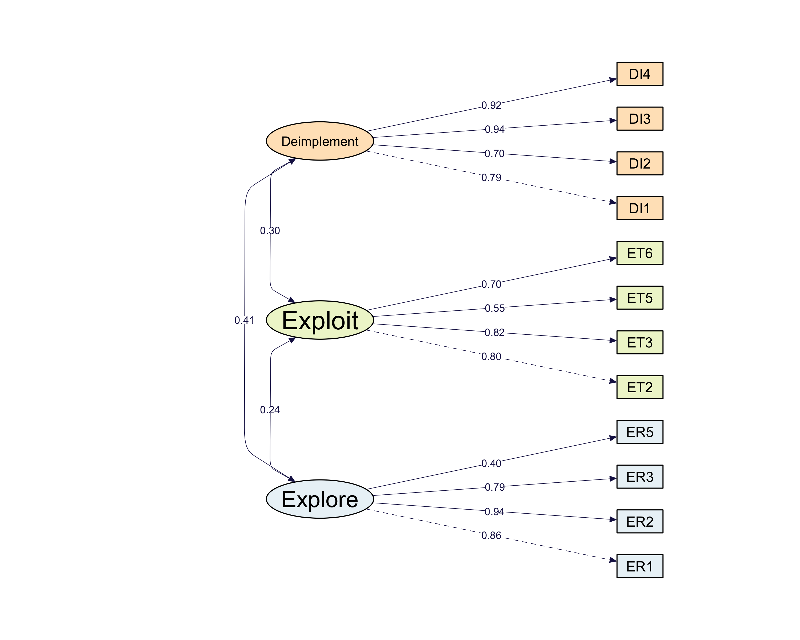

```{r setup, include=FALSE}
knitr::opts_chunk$set(echo = FALSE, message = FALSE)
```

```{r library, message=FALSE}
library(ggplot2)
library(dplyr)
library(tidyr)
library(tidyverse)
library(tidyLPA)
library(kableExtra)
library(knitr)
library(skimr)
library(gtsummary)
library(gt)
library(broom)
library(glmnet)
```

```{r import helper functions, message=FALSE}
source("helper_functions.R")
```

```{r load data}
oath_data <- readRDS("Data/oath_data_fa_final.rds")
lpa_data <- oath_data %>% 
  select(Explore, Exploit, Deimplement) %>% 
  drop_na()

dim(oath_data)
```

# Check Construct (CFA Scores) Correlation

```{r}
# Compute the Pearson correlation matrix from your factor scores dataframe
corr_matrix <- cor(lpa_data, method = "pearson", use = "complete.obs")

# 2. Reshape the matrix into a long format for ggplot
corr_long <- corr_matrix %>%
  as.data.frame() %>%
  tibble::rownames_to_column(var = "Var1") %>%
  pivot_longer(cols = -Var1, names_to = "Var2", values_to = "Correlation")

# 3. Create the heatmap
ggplot(corr_long, aes(x = Var1, y = Var2, fill = Correlation)) +
  geom_tile(color = "white", linewidth = 0.5) +
  geom_text(aes(label = sprintf("%.2f", Correlation)), 
            color = ifelse(abs(corr_long$Correlation) > 0.5, "white", "black"), 
            size = 3) +
  # Define a smooth, neutral color gradient (diverging from blue to red)
  scale_fill_distiller(
    palette = "RdBu",
    direction = 1, 
    limit = c(-1, 1),
    name = "Pearson\nCorr"
  ) +
  theme_minimal() +
  theme(
    axis.title.x = element_blank(),
    axis.title.y = element_blank(),
    panel.grid.major = element_blank(),
    panel.border = element_blank(),
    axis.text.x = element_text(angle = 45, vjust = 1, hjust = 1, size = 9),
    axis.text.y = element_text(size = 9),
    legend.title = element_text(size = 8)
  ) +
  # Keep the layout perfectly square
  coord_fixed()
```


## CFA loadings



# Fit LPA

```{r fit}
all_lpa_fits <- lpa_data %>% 
  estimate_profiles(n_profiles = 1:5, models = c(1, 2, 3, 6))

# Print the overall comparison table directly to your console
fit_table <- get_fit(all_lpa_fits)

fit_table %>%
  select(
    `Model Type` = Model, 
    `Profiles (k)` = Classes, 
    AIC, 
    BIC, 
    Entropy, 
    prob_min, 
    n_min,
    `BLRT p-val` = BLRT_p
  ) %>%
  kable(
    format = "html", 
    caption = "Latent Profile Analysis (LPA) Model Fit Comparison",
    digits = 2
  ) %>%
  kable_styling(
    bootstrap_options = c("striped", "hover", "condensed", "responsive"),
    full_width = TRUE,
    position = "center"
  ) %>% 
  collapse_rows(
    columns = 1,
    valign = "middle"
  )
```


## LPA Model Selection

- Candidate models:

  - 
  - Model 2 with 3 classes
  - Model 2 with 4 classes
  - Model 3 with 3 classes
  
```{r}
# 1. Extract all fit statistics from the full multi-model object
fit_metrics_raw <- get_fit(all_lpa_fits)

# 2. Filter down to your specific candidate models using the correct column names
candidate_metrics_table <- fit_metrics_raw %>%
  filter(
    (Model == 2 & Classes == 4) |
    (Model == 2 & Classes == 3) |
    (Model == 3 & Classes == 3)
  ) %>%
  # 3. Select the metrics using the exact tidyLPA output names
  select(
    `Model Type` = Model, 
    `Profiles (k)` = Classes, 
    AIC, 
    BIC, 
    Entropy, 
    `Min Profile Size (Prop)` = prob_min, # Smallest group proportion[cite: 5]
    `Min Count` = n_min,                  # Smallest group count (N)[cite: 5]
    `BLRT p-val` = BLRT_p
  ) %>%
  # 4. Clean up the naming conventions for your presentation
  mutate(
    `Model Type` = case_when(
      `Model Type` == 2 ~ "Model 2 (Varying Var)",
      `Model Type` == 3 ~ "Model 3 (Equal Var)",
      TRUE ~ as.character(`Model Type`)
    )
  )

# 5. Output the clean table to your console or view it
candidate_metrics_table %>% knitr::kable(digits = 2)


candidate_metrics_table
```

```{r}
ahp_scores <- fit_metrics_raw %>% AHP()
```

```{r}
compare_solutions(all_lpa_fits)
```


```{r}
write.csv(fit_metrics_raw, "Plots/lpa_fit_metrics.csv", row.names=FALSE)
```

## LPA Model Comparison

```{r extract candidate models and plot, message=FALSE}
# Extract the target models from the all_lpa_fits list
# model2_3class <- all_lpa_fits[[8]]
model2_4class <- all_lpa_fits[[9]]
# model3_3class <- all_lpa_fits[[13]]
```

### Model 2 with 4 Profiles

```{r plot mod 2 prof 4}
# Plot Model 2 (Varying Variances) - 4 Classes
plot_lpa_profiles(
  model2_4class, 
  plot_title = "LPA Model 2: 4-Profile Solution"
)

get_profile_sizes(model2_4class) %>% knitr::kable(caption = "LPA Model 2 (Varying Var): 4-Profile Solution")
```

- Profile 1 (n=70, 46.67%): Status-quo group, maintaining consistent, slightly above-average effort allocation across exploration, exploitation, and de-implementation.

- Profile 2 (n=7, 4.67%): High-performers across all dimensions. 

- Profile 3 (n=10, 6.67%): High-performers in de-implementation, but at near average level in exploitation and exploration. 

- Profile 4 (n=63, 42.00%): Below-average across all fields, with an exceptionally low prioritization of de-implementation.

```{r}
m24_means <- get_estimates(model2_4class) %>% 
  filter(Category == "Means")

write.csv(m24_means, "Plots/lpa_mean_score.csv")
```

```{r}
library(dplyr)
library(tidyr)

# Get predicted class assignments from fitted Model 2 (k = 4)
class_data <- get_data(model2_4class) 

# Compute within-profile correlation matrices
within_class_corrs <- class_data %>%
  group_by(Class) %>% # or 'profile' depending on output column name
  nest() %>%
  mutate(cor_matrix = map(data, ~ cor(.x[, c("Deimplement", "Exploit", "Explore")], 
                                     use = "pairwise.complete.obs")))

# Print correlation matrix for each profile
for(i in 1:nrow(within_class_corrs)) {
  cat("\n=== Profile", within_class_corrs$Class[i], "Correlation Matrix ===\n")
  print(round(within_class_corrs$cor_matrix[[i]], 2))
}
```


```{r store output}
# Extract classifications for all three candidate models
# class_m2_3c <- model2_3class$model$classification
class_m2_4c <- model2_4class$model$classification
# class_m3_3c <- model3_3class$model$classification

# Append all three as distinct factor columns
regression_data_all <- oath_data %>%
  mutate(
    # Profile_M2_3C = factor(class_m2_3c),
    Profile_M2_4C = factor(class_m2_4c),
    # Profile_M3_3C = factor(class_m3_3c)
  )

saveRDS(regression_data_all, "Data/regression_data_all.rds")
```


# Regression

```{r load data reg}
# load regression data
oath_data <- readRDS("Data/regression_data_all.rds")
# dim(oath_data)
```

## Regression Data Preparation

```{r prepare reg data}
# pre-processing
regression_data <- oath_data %>%
  # Compute row-wise mean scores
  mutate(
    OCI_mean = rowMeans(pick(starts_with("ocis")), na.rm = TRUE)
  ) %>%
  # Binning role variables
  mutate(
    role_combined = case_when(
      role_oath_v2 %in% c("Manager", "Educator", "Supervisor/Team Leader") ~ "Manager/Educator/Supervisor",
      role_oath_v2 %in% c("Director", "Senior Leadership") ~ "Director/Senior Leadership",
      role_oath_v2 == "Professional Staff" ~ "Professional Staff",
      TRUE ~ NA_character_
    ),
    years_role_binned = case_when(
      years_role_oath_v2 %in% c("Less than 1 year", "1-3", "3-6") ~ "Less than 6 years",
      years_role_oath_v2 %in% c("6-9", "10+") ~ "6 years or more",
      TRUE ~ NA_character_
    ),
    years_employed_binned = case_when(
      years_employed_thp_v2 %in% c("Less than 1 year", "1-3", "3-6") ~ "Less than 6 years",
      years_employed_thp_v2 %in% c("6-9", "10+") ~ "6 years or more",
      TRUE ~ NA_character_
    ),
    
    # Convert new variables to factors for regression mapping
    role_combined = factor(role_combined),
    years_role_binned = factor(years_role_binned),
    years_employed_binned = factor(years_employed_binned),
    site_oath_v2 = factor(site_oath_v2)
  ) %>%
  select(
    OCI_mean,
    Profile_M2_4C,
    site_oath_v2,
    role_combined,
    years_role_binned,
    years_employed_binned
  )

nrow(regression_data)
```


```{r}
regression_data %>% group_by(Profile_M2_4C, role_combined) %>% 
  summarise(n = n())
```

## Regression Sample Summary

```{r}
get_category_summary(regression_data %>% 
                       select(-c(OCI_mean, all_of(starts_with("Profile")))), 
                     caption = 'Sample summary')
```

```{r}
summary(regression_data$OCI_mean)
sd(regression_data$OCI_mean, na.rm = TRUE)
```


## Regression - LPA model 2 with 4 profiles

### Profile-only

- Outcome: average OCI score.

- Predictors: profile assignment based on LPA model 2 (4 profiles)

```{r}
# Fit OCI model using Model 2 (2 Classes)
fit_m2_4c <- lm(OCI_mean ~ Profile_M2_4C, data = regression_data)
summary(fit_m2_4c)
# render_full_regression_table(fit_m2_4c)
```

### Full model

- Outcome: average OCI score.

- Predictors: 

    - profile assignment based on LPA model 2 (4 profiles)
    - site
    - role
    - years in role
    - years employed

```{r}
# --- Model 2 (4 Classes) ---
mlr_m2_4c <- lm(OCI_mean ~ ., data = regression_data)
summary(mlr_m2_4c)
```

### Variable selection

```{r stepwise bic 3}
null_model <- lm(OCI_mean ~ 1, data = regression_data)
slr_model <- lm(OCI_mean ~ Profile_M2_4C, data = regression_data)
full_model <- lm(OCI_mean ~ ., data = regression_data)

# Run stepwise selection using BIC

stepwise_bic_both <- step(
  slr_model,
  direction="both",
  scope=list(lower=slr_model, upper=full_model),
  k=log(nrow(regression_data)), # bic
  trace=FALSE
)

# View the final selected model
summary(stepwise_bic_both)
```

#### Stepwise (BIC)

```{r}
render_full_regression_table(stepwise_bic_both)
```


## Final SLR model

```{r}
fit_m2_4c <- lm(OCI_mean ~ Profile_M2_4C, data = regression_data)
summary(fit_m2_4c)
```


